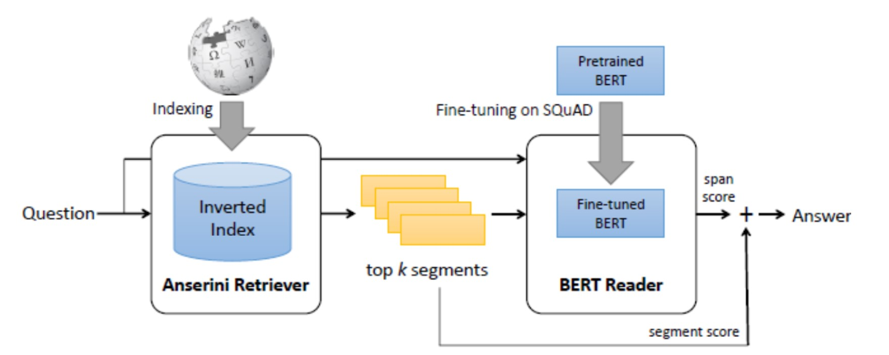
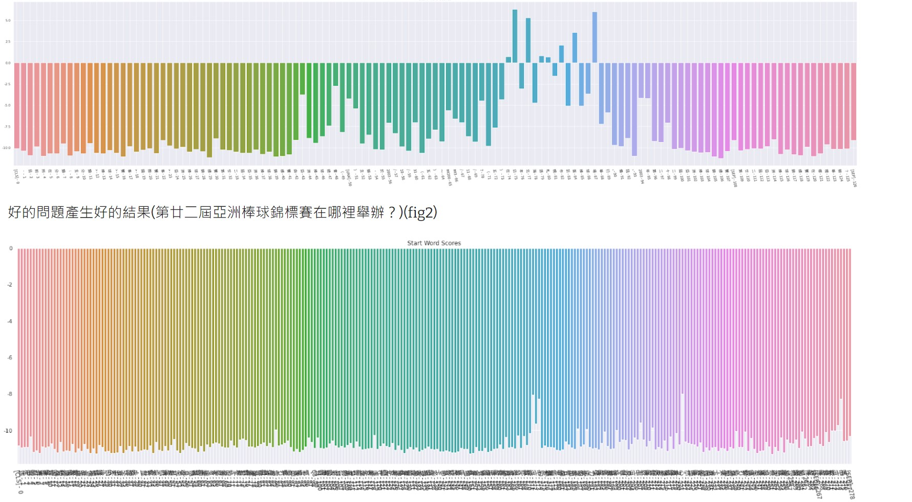

#  Introduce 
## Open-Domain
Refers to a task or system setting in natural language processing (NLP) and information retrieval.
The system needs to handle questions without specific range or domain restrictions.
The system should be able to understand and answer questions from various topics or domains, not just limited to a specific field.
## Question Answering
Retrieval systems only find articles with high similarity from the database.
By fine-tuning with NLP, we can extract key points from these high-similarity articles.
These key points' scores are composed of segment scores (seg score) and span scores (span score). e build the link or the graph of let us get the good result in the QA
1. model

# Score accurate:
Using score.max() in Retriever text may result in low scores, leading to poorly generated questions because the original information is not good.
Even if we enhance the answers, the results may not be very good.
When questions contain specific information, it helps in finding the correct passages, thus generating accurate answers.
If the questions lack specific and detailed information, finding the correct answers becomes more difficult.

